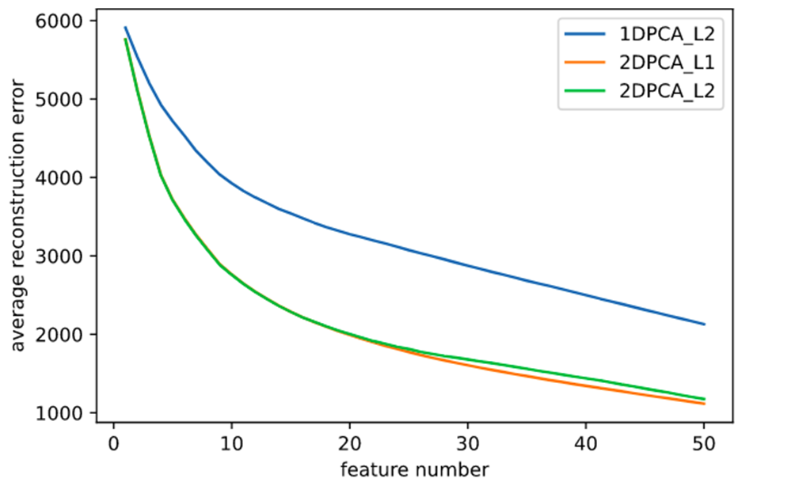

# 2D PCA 

## 2DPCA 实现:

### 2D PCA L2

```python
def PCA_2D(image_array):
    Eimage_array=np.zeros_like(image_array[0],dtype=float)
    for i in range(len(image_array)):
        Eimage_array+=image_array[i]
    Eimage_array/=len(image_array)
    image_centered=image_array-Eimage_array
    G_t=np.zeros((image_array[0].shape[1],image_array[0].shape[1]))
    for i in range(len(image_array)):
        G_t+=image_centered[i].T@image_centered[i]
    G_t/=len(image_array)
    w_G_t,v_G_t=np.linalg.eigh(G_t)
return (w_G_t[::-1],v_G_t[:,::-1])

```

### 2D PCA L1

```python
def PCA_2D_L1_one_dimension(image_centered,max_turn):
    u_t=np.random.rand(image_centered.shape[-1])-0.5
    u_t/=np.sqrt(u_t@u_t.T)
    while True:
        turn_count=0
        tmp=image_centered@u_t
        polarity=np.zeros(image_centered.shape[:2],dtype=int)
        polarity[tmp>0]=1
        polarity[tmp<=0]=-1
        u_t_new=sum([polarity[i]@image_centered[i] for i in range(len(polarity))])
        u_t_new=u_t_new/np.sqrt(u_t_new@u_t_new.T)
        delta=u_t_new-u_t
        if ((delta.max()-delta.min())<1e-5):
            break 
        if turn_count>=max_turn:
            print('Max turn')
            break
        turn_count+=1
        u_t=u_t_new
    return u_t_new

def PCA_2D_L1(image_centerer,max_turn,dimension):
    p_vectors=[PCA_2D_L1_one_dimension(image_centered,max_turn)]
    last_image=image_centered
    for i in range(1,dimension):
        last_v=p_vectors[-1].reshape(last_image.shape[-1],1)
        new_image=last_image-last_image@last_v@last_v.T
        last_image=new_image
        p_vectors.append(PCA_2D_L1_one_dimension(new_image,max_turn))
return np.array(p_vectors).T

```

## 2D PCA结果分析:

1. 特征值随特征向量数的变化如下:      


2. 平方和所占百分比和:


3. 基于2D PCA的图像重构, 分别采取2,4,6,8,10个特征值:


与1D PCA比较:


4. 2D PCA图像重构中第1,2,4,7,10个特征得到的子图:


当取4个特征向量时, 所获得的图像已经占了90%的能量, 舍去更低维度是合理的.

## 可视化分布对比:

1D PCA(降到二维):


2D PCA(取前4个特征向量后用PCA降到2维):


L1-2D PCA(取前4个特征向量后用PCA降到2维):


##  聚类(k-means):

取1D-PCA-L2前10个特征值进行k-means聚15类,聚10次, 算出F值在0.616-0.711之间


取2D-PCA-L2前4个特征向量进行k-meas聚15类,聚10次, 算出F值在0.658-0.713之间


取2D-PCA-L1前4个特征向量进行k-meas聚15类, 聚10次, 算出F值在 0.640-0.711之间

## 分类(KNN)

对1D-PCA-L2,在取前17个特征向量,k=1时可获得最小的错误率18.2%

对2D-PCA-L2,在取前6个特征向量,k=1时可获得最小的错误率18.2%

对2D-PCA-L1,在取前4个特征向量,k=1时可获得最小的错误率18.2%

## 计算图像重构损失:


发现2DPCA_L2和2DPCA_L1重构误差大致相同, 且均远小于传统的PCA_L2.

## 基于加入噪声的二维图像PCA:

首先将yale数据裁减成100*80大小,取出其中的20%加上30*30-60*60大小的噪声矩阵(矩阵内数值为(0/255),含有噪声的图如下:


计算图像重构损失如下:



可以发现2D PCA(L1)在维度较高时优于2D PCA(L2), 且2D PCA均优于1D PCA

 

## PCA 以及两种 2D PCA 在不同类型数据下的优劣势

传统的PCA在图片维度较大时会产生较大的协方差矩阵, 难以运算.

而2D-PCA(L2)的协方差矩阵较小, 可以快速的计算出结果. 并且性能也优于传统的PCA, 但是获得的特征向量维度太大,可以通过进一步的pca解决. 

2D-PCA(L1)需要使用迭代收敛进行计算, 计算效率较低, 但是在数据集有一些离散点时具要比2D -PCA(L2)性能好

## Robust PCA

### 1.实现:

```python
class Robust_PCA:
    def __init__(self,D):
        self.D=D.astype(np.double)
        self.Y=np.zeros_like(self.D)
        self.S=np.zeros_like(self.D)
        self.L=np.zeros_like(self.D)
        self.delta=np.linalg.norm(self.D,ord='fro')*1e-7
        self.miu=np.prod(D.shape)/(4*np.linalg.norm(self.D,ord=1))
        self.miu_inv=1/self.miu
        self.lmbda=1/np.sqrt(np.max(D.shape))

    def S_tou(self,M,tou):
        return np.sign(M)*np.maximum((np.abs(M)-tou),np.zeros_like(M))
    
    def D_tou(self,X,tou):
        U, Sigma, V = np.linalg.svd(X, full_matrices=False)
        return U@np.diag(self.S_tou(Sigma,tou))@V

    def fit(self,max_iter=2001,print_iter=100):
        for i in range(max_iter):
            self.L=self.D_tou(self.D-self.S+self.miu_inv*self.Y,self.miu_inv)
            self.S=self.S_tou(self.D-self.L+self.miu_inv*self.Y,self.miu_inv*self.lmbda)
            tmp=self.D-self.L-self.S
            self.Y+=self.miu*tmp
            judge=np.linalg.norm(tmp,ord='fro')
            if(i%print_iter==0):
                print(i,judge)
            if(judge<self.delta):
                print(i,judge)
                break
        return (self.L,self.S)

```

### 2.证明:


### 3.实验:

将下图(1.gif):


加上椒盐噪音(noise_image.gif):


对此加上噪音的图片进行Robust-PCA:

 

robust_pca=Robust_PCA(noise_image)

L,S=robust_pca.fit(max_iter=3000,print_iter=250)

 

分解出L,S:


成功滤去了噪音


## References

+ Yang, Jian, et al. "Two-dimensional PCA: a new approach to appearance-
based face representation and recognition." IEEE transactions on pattern
analysis and machine intelligence 26.1 (2004): 131-137.
+ Li, Xuelong, Yanwei Pang, and Yuan Yuan. "L1-norm-based 2DPCA." IEEE
Transactions on Systems, Man, and Cybernetics, Part B (Cybernetics) 40.4
(2010): 1170-1175.
+ Kwak, Nojun. "Principal component analysis based on L1-norm maximization."
IEEE transactions on pattern analysis and machine intelligence 30.9 (2008):
1672-1680.
+ Candès, Emmanuel J., et al. "Robust principal component analysis?." Journal
of the ACM (JACM) 58.3 (2011): 1-37.